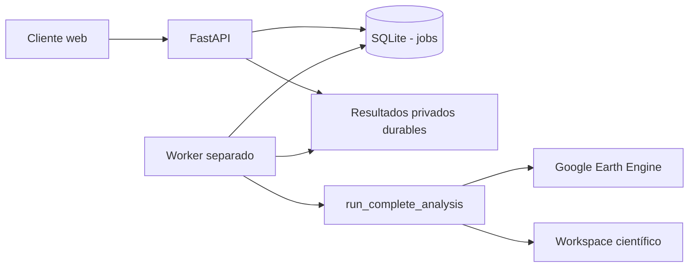
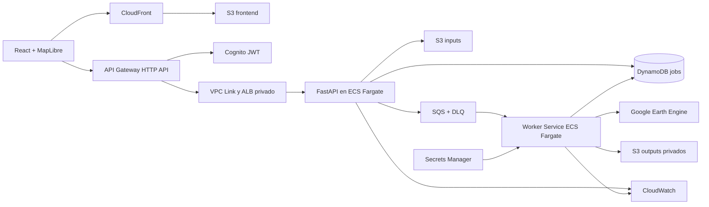

# Contexto de arquitectura: API y cliente web

## 1. Propósito de este documento

Este archivo define cómo exponer el pipeline mediante una API interna y un
cliente web sin acoplar la lógica científica a HTTP, AWS o una interfaz.
Complementa `AGENTS.md`, `README.md` y `NEXT_STEPS.md`; no reemplaza los
contratos científicos ni constituye un registro histórico de pasos.

**Estado al 18 de agosto de 2026:** los Incrementos 1–4 y su endurecimiento
previo a contenedores están implementados
localmente: validación GeoJSON, contrato `/api/v1`, registro SQLite idempotente,
worker separado con concurrencia uno, resultados verificables y cliente web.
Un gate multiproceso sin GEE ya verifica HTTP → SQLite → worker →
`report_assets` → publicación privada → HTTP. El smoke web real completó los
componentes obligatorios y terminó `partial` sólo por Hampel diagnóstico no
bloqueante. Además, los Incrementos PDF 1-2 ya aportan un renderer determinístico
independiente y validado contra el expediente real, todavía sin integración en
worker/API/web. Antes de contenerizar se completará su publicación. Esto no
demuestra todavía estabilidad cloud, escalado concurrente ni validez temática
independiente.

## 2. Función principal de la API

La API será una **capa de interacción y orquestación**. Su responsabilidad es:

1. recibir un `Polygon` o `MultiPolygon` en GeoJSON;
2. validar formato, CRS, topología, ubicación, tamaño y permisos;
3. registrar una solicitud idempotente de análisis;
4. ejecutar el pipeline fuera del ciclo de la petición HTTP;
5. exponer estado, etapa actual y errores sanitizados;
6. publicar solamente los resultados autorizados del expediente;
7. entregar `report_dataset.json`, figuras, tablas y descargas auditables.

La API **no** decide si existe cumplimiento legal, no modifica umbrales
científicos, no interpreta un fallo como ausencia de cambio y no puede emitir
`conversion_confirmed` automáticamente.

## 3. Alcance inicial y no objetivos

### Incluido

- API interna versionada `/api/v1`.
- Un establecimiento y un polígono por solicitud.
- GeoJSON en EPSG:4326 con `Polygon` o `MultiPolygon`.
- Ejecución asíncrona del orquestador existente.
- Consulta de estado y resultados.
- Cliente web para cargar o dibujar el polígono.
- Descarga controlada del paquete de evidencia.
- Infraestructura AWS reproducible mediante código.

### Diferido

- portal público sin autenticación;
- lotes masivos y prioridades comerciales;
- Shapefile ZIP, GeoPackage u otros contenedores en el primer incremento;
- edición GIS avanzada;
- trazabilidad animal, RENSPA o integraciones SENASA;
- cobros, organizaciones complejas o multi-tenancy avanzado;
- certificación o presentación automática ante sistemas EUDR.

GeoJSON reduce superficie de ataque y ambigüedad. Un ZIP Shapefile incorpora
riesgos de traversal, archivos auxiliares, codificaciones y bombas de
descompresión; se agregará únicamente después de tener sandbox y límites
probados.

## 4. Principios rectores

1. **El núcleo sigue siendo Python puro.** El worker invoca
   `run_complete_analysis()`; no ejecuta ni parsea la CLI.
2. **HTTP nunca espera el análisis completo.** `POST /analyses` responde
   `202 Accepted` después de validar y registrar.
3. **Los jobs son idempotentes.** Reintentos de red no crean dos análisis.
4. **El filesystem no es una API.** Ningún endpoint acepta rutas locales ni
   devuelve paths absolutos.
5. **Los bundles científicos son autoritativos.** El worker verifica y publica
   una copia curada durable de `report_assets`; la web la consume sin
   reinterpretar TIFF ni reglas por su cuenta.
6. **La incertidumbre se conserva.** `partial`, `review_required` e
   `insufficient_data` son resultados visibles.
7. **Privacidad por defecto.** Geometrías, identificadores y resultados son
   privados, cifrados y accesibles sólo al propietario o revisor autorizado.
8. **Concurrencia acotada.** El MVP comienza con un worker y una ejecución GEE
   simultánea hasta medir cuotas, duración, CPU, memoria y almacenamiento.

## 5. Contrato HTTP inicial

### 5.1 Validar geometría

```http
POST /api/v1/geometries/validate
Content-Type: application/geo+json
```

Respuesta `200`:

```json
{
  "geometry_type": "Polygon",
  "source_crs": "EPSG:4326",
  "valid": true,
  "repair_required": false,
  "area_ha_estimate": 1438.42,
  "warnings": []
}
```

Esta operación no crea un análisis ni consulta GEE.

### 5.2 Crear análisis

```http
POST /api/v1/analyses
Idempotency-Key: <uuid-del-cliente>
Content-Type: application/json
```

```json
{
  "establishment_id": "establecimiento-2",
  "geometry": {
    "type": "Feature",
    "properties": {},
    "geometry": {
      "type": "Polygon",
      "coordinates": []
    }
  },
  "declared_land_use": "unknown",
  "declared_context_source": "user_declared"
}
```

Respuesta `202`:

```json
{
  "analysis_id": "uuid",
  "status": "queued",
  "status_url": "/api/v1/analyses/uuid",
  "created_at": "ISO-8601"
}
```

El servidor fija configuraciones y versiones permitidas. El cliente no puede
enviar rutas de modelos, credenciales, nombres de buckets ni parámetros
científicos arbitrarios.

### 5.3 Consultar estado

```http
GET /api/v1/analyses/{analysis_id}
```

Estados operativos:

```text
queued -> validating -> running -> completed | partial | failed
   \-> cancelled        \-> cancelling -> cancelled | completed | partial | failed
```

El progreso se expresa como `stage` y no como un porcentaje ficticio:

```json
{
  "analysis_id": "uuid",
  "status": "running",
  "stage": "agricultural_collection",
  "started_at": "ISO-8601",
  "updated_at": "ISO-8601",
  "attempt": 1,
  "safe_error_code": null
}
```

### 5.4 Resultados

```http
GET /api/v1/analyses/{analysis_id}/report
GET /api/v1/analyses/{analysis_id}/events
GET /api/v1/analyses/{analysis_id}/assets
GET /api/v1/analyses/{analysis_id}/assets/{asset_id}
GET /api/v1/analyses/{analysis_id}/download
POST /api/v1/analyses/{analysis_id}/cancel
```

- `/report` entrega el objeto versionado `report_dataset.json` después de
  comprobar su SHA-256 contra el índice y el registro del job;
- `/events` pagina el inventario completo referenciado por
  `event_selection.complete_event_inventory_path`; no confunde ese inventario
  con `selected_events` ni envía rasters;
- `/assets` lista únicamente la allowlist de `report_assets/index.json`, con ID
  opaco, tipo, tamaño, hash y URL de descarga, nunca rutas absolutas;
- `/assets/{asset_id}` vuelve a verificar ruta, tamaño y SHA-256 antes de servir
  el archivo;
- `/download` sirve el ZIP determinístico que preparó el worker desde la misma
  allowlist, con hash y tamaño en un sidecar privado;
- `/report`, `/events` y `/assets` leen exclusivamente
  `storage_root/analyses/{analysis_id}/results`; no dependen de que sobreviva el
  workspace científico registrado en `output_prefix`;
- en el prototipo local las URLs son internas y directas; en AWS se reemplazan
  por URLs firmadas y breves sin cambiar el catálogo lógico;
- `cancel` es best-effort y nunca finge que una tarea GEE ya enviada fue
  eliminada si no existe confirmación.

Un resultado vencido responde `410 analysis_expired`. Al iniciar, la API purga
solamente `storage_root/analyses/{analysis_id}` de jobs vencidos no activos y
conserva tanto el registro SQLite para auditoría como los bundles científicos
de `outputs/runs`.

## 6. Modelo persistente del job

Campos mínimos de `AnalysisJob`:

```text
analysis_id
owner_id
idempotency_key
establishment_id
input_object_key
input_sha256
status
stage
attempt
created_at / started_at / updated_at / completed_at
configuration_versions
code_revision
worker_task_id
output_prefix
parent_manifest_sha256
report_dataset_sha256
safe_error_code
expires_at
```

Las transiciones de estado deben ser condicionales. Dos workers no pueden
adquirir el mismo job y un reintento no puede convertir `completed` nuevamente
en `running`.

## 7. Arquitectura local antes de AWS



El primer prototipo utiliza dos procesos separados:

- `api`: valida, registra y consulta;
- `worker`: adquiere un job, ejecuta el pipeline y publica el resultado.

No se usará `FastAPI BackgroundTasks` como motor de producción: si el proceso
web reinicia, se pierde el trabajo y su ownership.

La implementación vive en un `uv workspace` modular:

```text
packages/domain/src/deforestation_domain # geometría y área sin GEE/raster
packages/jobs/src/deforestation_jobs     # estados y repositorio SQLite
packages/reporting/src/deforestation_reporting # contrato y renderer PDF
services/api/src/deforestation_api       # adaptador HTTP
services/worker/src/deforestation_worker # ejecución científica separada
```

Los cinco proyectos Python comparten `uv.lock`, pero conservan `pyproject.toml`,
código y pruebas propios. La API depende de `deforestation-domain`, no de
`deforestation-pipeline`; así su futura imagen no arrastra Earth Engine, geemap,
rasterio ni el resto del runtime científico. El límite jurisdiccional local se deriva de la capa oficial
`ign:pais` del IGN y se conserva con hash y transformación documentada en
`data/boundaries/`. Es un filtro operativo, no evidencia legal o catastral.

## 8. Arquitectura objetivo en AWS



### Decisiones principales

- **ECS Fargate para el worker:** el pipeline es contenerizado, usa librerías
  geoespaciales nativas y puede exceder quince minutos. Lambda queda limitada a
  tareas breves auxiliares. El MVP usa un ECS Service con un consumidor SQS y
  concurrencia uno; una evolución podrá lanzar tareas standalone para escalar a
  cero mediante un dispatcher u orquestador explícito.
- **SQS con DLQ:** desacopla API y procesamiento. Su entrega es al menos una
  vez, por lo que el worker debe ser idempotente y extender visibility timeout
  mediante heartbeat. Si un run puede superar doce horas, se debe dividir o
  migrar su coordinación a Step Functions.
- **S3 privado:** entradas y expedientes se almacenan por prefijo
  `analyses/{analysis_id}/`. Uploads y downloads futuros usan URLs prefirmadas,
  checksums, expiración y claves no reutilizables.
- **Publicación S3 por commit marker:** S3 no ofrece rename atómico de un
  directorio. El worker sube primero a un prefijo temporal, verifica tamaños y
  hashes, publica `run_manifest.json` y finalmente un objeto `COMPLETED.json`.
  La API no expone un resultado hasta validar ese marker.
- **DynamoDB:** el registro de jobs es pequeño y orientado por clave; las
  escrituras condicionales protegen transiciones e idempotencia. Si aparecen
  consultas relacionales complejas, organizaciones y reporting operacional,
  evaluar RDS PostgreSQL sin contaminar el dominio.
- **API Gateway + Cognito:** validación JWT, scopes y rate limits delante del
  servicio. API Gateway llega al servicio ECS privado mediante VPC Link y un
  Application Load Balancer; no existe una conexión directa API Gateway–ECS.
  El acceso inicial es privado o de usuarios invitados explícitos.
- **Secrets Manager:** sólo el worker puede recuperar credenciales GEE. Nunca
  llegan al navegador, a DynamoDB ni al manifest público.
- **CloudWatch:** logs JSON con `analysis_id`, métricas, alarmas y Container
  Insights. No registrar geometrías completas, tokens ni URLs firmadas.
- **ECR:** imágenes versionadas por digest para API y worker.
- **AWS CDK v2 en Python:** infraestructura reproducible y coherente con el
  stack actual. Terraform sigue siendo alternativa si el equipo adopta una
  política multi-cloud.

La región AWS no se fija todavía. Debe decidirse comparando residencia de
datos, latencia, servicios disponibles y costo; no hardcodearla por comodidad.

El worker necesita salida HTTPS hacia Google Earth Engine. La opción objetivo
es ejecutarlo en subnets privadas con egress controlado; S3 y DynamoDB usarán
VPC endpoints cuando corresponda y el acceso a Internet requerirá NAT. El costo
y la alta disponibilidad de NAT deben medirse explícitamente en `dev` antes de
replicar gateways por zona. El run se materializa primero en almacenamiento
efímero del task; si las mediciones superan su presupuesto, evaluar EFS o ECS
sobre EC2 en vez de esconder el problema con más disco.

## 9. Tecnologías previstas

| Capa | Tecnología | Función |
| --- | --- | --- |
| Dominio | Python 3.12, Pydantic, Shapely, GeoPandas | Contratos y validación existente |
| API | FastAPI, Uvicorn, Pydantic v2 | OpenAPI, HTTP y serialización |
| Cliente | React, TypeScript, Vite | Interfaz web modular |
| Mapa | MapLibre GL JS | Visualizar GeoJSON y resultados espaciales |
| Estado cliente | TanStack Query | Polling, caché y estados remotos |
| Desarrollo local | SQLite + filesystem privado | Registro y bundles de prueba |
| SDK AWS | boto3 | Adaptadores S3, SQS, DynamoDB, ECS y Secrets |
| Contenedores | Docker + Amazon ECR | Reproducir API y worker |
| Cómputo | Amazon ECS sobre AWS Fargate | API persistente y workers batch |
| Cola | Amazon SQS + DLQ | Backpressure y reintentos controlados |
| Estado | Amazon DynamoDB | Jobs e idempotencia |
| Objetos | Amazon S3 + KMS | Inputs, outputs y report assets privados |
| Acceso | API Gateway + Cognito | JWT, scopes y límites |
| Frontend AWS | S3 + CloudFront | Aplicación estática y TLS |
| Secretos | AWS Secrets Manager | Credenciales GEE y configuración sensible |
| Observabilidad | CloudWatch Logs, métricas y alarmas | Diagnóstico operacional |
| Infraestructura | AWS CDK v2 en Python | IaC mediante CloudFormation |
| Pruebas | Pytest, FastAPI TestClient, boto3 Stubber | Contratos y adaptadores |
| Pruebas web | Vitest y Playwright | Componentes y flujo extremo a extremo |

Las dependencias de API, frontend e infraestructura se incorporarán en grupos
o proyectos separados. No deben inflar el entorno científico hasta que cada
incremento las necesite.

## 10. Seguridad y privacidad

- tamaño máximo de request y cantidad máxima de vértices;
- sólo coordenadas dentro de Argentina y geometrías poligonales;
- normalización a EPSG:4326 con seis decimales para intercambio;
- hashes de input antes de encolar;
- nombres de objeto generados por servidor, nunca por filename del usuario;
- buckets privados, bloqueo de acceso público, cifrado KMS y TLS;
- IAM mínimo por servicio y separación entre rol API y rol worker;
- URLs prefirmadas cortas y asociadas a una clave inmutable;
- retención y borrado versionados por tipo de dato;
- auditoría de creación, lectura, descarga y cancelación;
- CORS explícito, CSP en cliente y headers de seguridad;
- mensajes de error seguros; detalles remotos sólo en logs restringidos;
- geometrías y datos productivos jamás en fixtures públicos o telemetría.

## 11. Evolución incremental

### Incremento 0 — Gate operativo

- ejecutar un smoke real de los seis componentes;
- verificar `complete` o `partial` científicamente explicado;
- comprobar `report_assets`, hashes y recolección agrícola compartida;
- medir duración, disco, memoria y cantidad de requests GEE.

**Salida:** baseline operacional para dimensionar API y worker.

### Incremento 1 — Endpoint de validación

- crear paquete `api` separado;
- agregar `GET /health` y `POST /api/v1/geometries/validate`;
- aceptar únicamente GeoJSON Polygon/MultiPolygon;
- generar OpenAPI y errores de dominio estables;
- tests sin GEE.

**Salida:** un cliente puede validar un polígono sin ejecutar análisis.

**Estado:** implementado localmente. Incluye límite de vértices y request,
frontera jurisdiccional versionada, área en CRS equivalente, errores estables y
OpenAPI probado sin GEE.

### Incremento 2 — Job local asíncrono

- `POST /api/v1/analyses` con `202` e idempotency key;
- repositorio de jobs SQLite;
- worker como proceso separado con concurrencia uno;
- invocación directa de `run_complete_analysis()`;
- `GET /api/v1/analyses/{id}` con estado y etapa;
- recuperación segura tras reinicio.

**Salida:** un análisis completo se solicita por HTTP sin bloquear el request.

**Estado:** implementado localmente. SQLite usa una restricción única por
propietario y clave idempotente, adquisición mediante transacción inmediata y
transiciones condicionales. El worker se ejecuta en otro proceso, valida el hash
del input, llama `run_complete_analysis()` directamente, publica
`completed/partial/failed` y recupera jobs activos al reiniciar. El MVP conserva
concurrencia uno; el smoke GEE completo sigue pendiente.

### Incremento 3 — Resultados y descargas

- proyectar `report_dataset.json` en `/report`;
- paginar `/events`;
- allowlist de `/assets` basada en `report_assets/index.json`;
- descarga empaquetada con hashes;
- cancelación best-effort y expiración local.

**Salida:** la API cubre el ciclo solicitud–estado–resultado.

**Estado:** implementado localmente. El worker copia únicamente el manifest,
dataset, índice y allowlist verificados a un prefijo privado durable antes de
marcar el job terminal. La lectura valida allí rutas, tamaños y SHA-256; los
eventos provienen del inventario completo y los assets se exponen sólo por ID
opaco. `output_prefix` queda como procedencia, no como dependencia operativa.
El worker crea el ZIP fuera del request HTTP y la
cancelación usa transiciones condicionales. Los jobs vencidos no se adquieren y
la retención borra únicamente objetos privados. La compatibilidad se comprobó
en lectura contra un expediente real preservado: 41 assets y cuatro eventos,
incluso después de desaparecer su workspace científico.

### Incremento 4 — Cliente web local

- React + TypeScript + MapLibre;
- carga y dibujo de geometría;
- validación visual, superficie y warnings;
- creación de análisis y polling;
- pantalla de estados `partial/failed/review_required`;
- galería principal y fichas por evento.

**Salida:** un usuario interno opera el pipeline sin PowerShell.

**Estado:** implementado como MVP minimalista en `apps/web`. Usa React,
TypeScript, Vite, MapLibre y TanStack Query sin mezclar dependencias Node con el
workspace científico Python. Permite cargar Polygon/MultiPolygon GeoJSON,
dibujar un Polygon, validar superficie y warnings, crear un análisis, hacer
polling, cancelar y leer resumen, eventos, figuras y descarga. El proxy de Vite
mantiene la API same-origin en desarrollo.

El gate web contiene quince pruebas Vitest, `tsc --noEmit` estricto y auditoría
de dependencias productivas sin vulnerabilidades conocidas. Requiere Node
20.19+ y recomienda Node 22.12 mediante `.nvmrc`; MapLibre queda fuera del
prebundle de Vite para evitar la pérdida de su worker en Windows.

La edición es deliberadamente básica: vértices, deshacer y cierre del polígono;
no incluye snapping, holes, edición avanzada ni conversión de CRS. El mapa de
desarrollo usa teselas públicas OpenStreetMap con atribución y debe reemplazarse
por un proveedor/política operativa antes de producción. El cliente conserva el
lenguaje de incertidumbre y no presenta ningún estado como certificación.

Para interoperar con exports GIS habituales sin ampliar el contrato HTTP, el
parser web acepta además una `FeatureCollection` sólo si contiene exactamente
una `Feature` Polygon/MultiPolygon y la normaliza antes de validar. Colecciones
múltiples siguen rechazadas: el MVP no debe inferir cómo unir establecimientos.

El feedback de progreso es explícitamente estimado porque el worker todavía no
emite porcentajes por componente. `queued`, `validating` y `running` tienen
pisos visuales y un avance temporal limitado al 92 %; únicamente un estado
terminal publicable llega a 100 %. El `analysis_id` se conserva como query
parameter validado para reanudar polling luego de una recarga, sin usar la URL
como fuente de verdad científica.

### Gate de integración local cerrado antes del Incremento 5

`tests/integration/test_api_worker_flow.py` ejecuta API y worker en procesos
separados, compartiendo únicamente SQLite y objetos temporales. El runner falso
vive bajo `tests/integration/support/`, nunca en el runtime productivo. El gate
crea el análisis por HTTP y verifica el ciclo completo hasta reporte JSON, PDF,
eventos, asset y ZIP. Esto prueba fronteras operativas locales, no ciencia ni
GEE.

El smoke real iniciado desde la web para `prueba-viale.geojson` creó el análisis
`c938a1c0-ca33-42a4-94b3-81c7276a3ef8`. Terminó `partial` porque Hampel quedó
`diagnostic_unavailable`, degradación explícita y no bloqueante; pipeline
principal, RF, agricultura, persistencia y atribución completaron. La API
verificó cuatro eventos y 41 assets desde la publicación privada. Este gate
habilita el Incremento 5, pero no sustituye validación temática independiente.

### Bloque previo - Informe técnico PDF

**Incremento PDF 1 - implementado.** `packages/reporting` verifica
`report_dataset.json` y las figuras declaradas en `report_assets/index.json`,
los proyecta a un view-model Pydantic acotado y genera un PDF A4 determinístico
y atómico. El documento incluye métricas, componentes, eventos, figuras,
limitaciones, hashes y un descargo legal explícito. No lee rasters, no depende
de GEE, FastAPI o React, y no transporta las series mensuales crudas al layout.

**Incremento PDF 2 - implementado.** `deforestation-reporting` `0.2.0` validó
el expediente real preservado con 41
assets, diez figuras generales, dos eventos priorizados y seis figuras de
evento. El renderer selecciona A4 apaisado para figuras con aspecto extremo y
A4 vertical para portada, tablas, mapas y fichas; el resultado tiene 21 páginas
inspeccionadas visualmente. La vista editorial elimina dos limitaciones de
detección obsoletas sólo cuando `post_change_attribution` está verificado como
`completed`, conservando intactos dataset, índice y hashes de origen.

**Incremento PDF 3 editorial - implementado.** `deforestation-reporting`
`0.6.0`, con contrato editorial `2.3.0`, reemplaza el cuerpo dominado por
figuras científicas por una proyección cliente de JSON, CSV y GeoJSON
verificados. El informe usa nueve páginas A4
verticales para resumen, línea base, mapa e inventario de los cuatro eventos,
condiciones de evidencia y trayectoria por evento priorizado, soporte agrícola,
sensibilidad, calidad, fuentes y limitaciones. Agrega seis páginas apaisadas
para cobertura RF anual y pérdidas candidatas, timeline RGB dividido en dos
páginas legibles y evidencia espectral de los dos eventos detallados. No
muestra P0 frente a multianual,
votos candidatos, desacuerdos de clase ni paneles crudos de detectores; esos
assets siguen hasheados y disponibles en el bundle técnico. El resumen usa una
tabla técnica compacta en lugar de tarjetas estilo dashboard. La portada agrega
un índice y cada apartado incorpora una introducción interpretativa. El loader
verifica además el `input.geojson` declarado mediante `run_manifest.json`; los
mapas usan ese perímetro, grilla WGS 84, norte, escala aproximada y un recuadro
localizador. Las fichas de evento agregan contexto vectorial OpenStreetMap al
50 % de opacidad, con atribución ODbL visible. El renderer no automatiza el tile
server comunitario: consulta pocos vectores mediante Overpass, normaliza la
respuesta y la cachea por extensión junto al PDF. El contexto no interviene en
la evidencia científica. Para producción debe usarse un proveedor autorizado o
servicio propio y revisar la exposición del bounding box de geometrías privadas.

**Incremento PDF 4 - implementado.** El worker `0.2.0` invoca el renderer como
postproceso después de validar `report_assets`, pasándole explícitamente el
GeoJSON privado sellado para no depender de la disposición del workspace
científico. Publica el PDF y su metadato de integridad dentro del prefijo privado
y los incluye en el ZIP determinístico. La API `0.2.0` expone
`GET /api/v1/analyses/{analysis_id}/report.pdf`; verifica esquema, tipo, tamaño,
cabecera PDF y SHA-256 antes de responder. El cliente web `0.2.0` muestra la
descarga directa sólo cuando el job terminó `completed` o `partial`. El request
HTTP nunca renderiza el documento.

### Incremento 5 — Contenerización

- imagen científica reproducible para worker;
- imagen liviana separada para API;
- usuario no root, healthchecks y límites de recursos;
- almacenamiento temporal explícito;
- digests de imagen y revisión de vulnerabilidades.

**Salida:** API y worker ejecutables de igual forma localmente y en CI.

### Incremento 6 — AWS mínimo

- CDK con ECR, S3 privado, DynamoDB, SQS/DLQ y ECS Fargate;
- API y worker con roles IAM distintos;
- inputs/outputs por prefijo de análisis;
- Secrets Manager para GEE;
- logs CloudWatch con correlation IDs;
- despliegue manual controlado en un entorno `dev`.

**Salida:** primer análisis remoto individual en AWS.

### Incremento 7 — Acceso web seguro

- S3 + CloudFront para frontend;
- API Gateway HTTP API;
- Cognito y scopes `analysis:write`, `analysis:read`, `asset:read`;
- WAF/rate limits si la exposición lo justifica;
- URLs prefirmadas y auditoría de descargas;
- ambientes `dev`, `staging` y `prod` separados.

**Salida:** usuarios internos autenticados pueden operar el servicio.

### Incremento 8 — Resiliencia y costos

- heartbeat SQS, reintentos acotados y DLQ operable;
- reconciliador de jobs huérfanos;
- alarmas por cola, fallos, duración, costo y cuota GEE;
- límites de concurrencia y backpressure;
- lifecycle S3, presupuestos AWS y tags de costos;
- backup/restore del registro de jobs;
- pruebas de fallo y recuperación.

**Salida:** operación repetible sin ocultar fallos ni duplicar análisis.

### Incremento 9 — API ampliada

- organizaciones y roles más finos;
- webhooks firmados;
- ejecución por lotes acotados;
- comparación de runs y versiones;
- evolución DOCX opcional y versionado editorial avanzado;
- métricas operativas y revisión humana documentada.

**Salida:** API interna completa, todavía separada de certificación y
trazabilidad animal.

## 12. Estrategia de pruebas

- TDD estricto para contratos y transiciones;
- tests unitarios sin AWS ni GEE;
- adapters AWS probados con fakes y `botocore.stub.Stubber`;
- integración API–SQLite–worker con runner científico falso;
- contract tests OpenAPI;
- tests de permisos entre propietarios;
- fixtures GeoJSON sintéticos: inválidos, multiparte, excesivos y fuera de país;
- prueba de idempotencia, doble entrega SQS y worker muerto;
- smoke GEE sólo en ambiente controlado;
- Playwright para carga, progreso, resultados y errores;
- ningún test publica coordenadas o credenciales reales.

## 13. Criterio de terminado del MVP web interno

- un usuario autenticado carga o dibuja un polígono;
- la API valida y devuelve un job idempotente;
- el análisis ocurre fuera del request;
- reinicios no pierden el job ni lo duplican;
- el cliente distingue `completed`, `partial` y `failed`;
- resultados provienen de `report_assets` con hashes verificables;
- inputs y outputs son privados y expiran según política;
- logs y métricas permiten reconstruir un fallo;
- se documentan costo y cuotas por análisis;
- ningún endpoint emite certificación ni `conversion_confirmed` automático.

## 14. Referencias técnicas verificadas

- [Lambda: timeout máximo de 900 segundos](https://docs.aws.amazon.com/lambda/latest/dg/configuration-timeout.html)
- [ECS: tareas standalone para trabajos batch](https://docs.aws.amazon.com/AmazonECS/latest/developerguide/standalone-tasks.html)
- [SQS: visibility timeout, heartbeat y límite de doce horas](https://docs.aws.amazon.com/AWSSimpleQueueService/latest/SQSDeveloperGuide/sqs-visibility-timeout.html)
- [S3: uploads y downloads mediante URLs prefirmadas](https://docs.aws.amazon.com/AmazonS3/latest/userguide/using-presigned-url.html)
- [API Gateway: autorización JWT para HTTP APIs](https://docs.aws.amazon.com/apigateway/latest/developerguide/http-api-jwt-authorizer.html)
- [API Gateway: integración privada de HTTP API con un servicio ECS](https://docs.aws.amazon.com/apigateway/latest/developerguide/http-api-private-integration.html)
- [DynamoDB: escrituras condicionales e idempotencia](https://docs.aws.amazon.com/amazondynamodb/latest/developerguide/WorkingWithItems.html)
- [ECS y Secrets Manager](https://docs.aws.amazon.com/secretsmanager/latest/userguide/integrating_how-services-use-secrets_ecs-sc.html)
- [CloudWatch Container Insights](https://docs.aws.amazon.com/AmazonCloudWatch/latest/monitoring/ContainerInsights.html)
- [AWS CDK v2 con Python](https://docs.aws.amazon.com/cdk/v2/guide/work-with-cdk-python.html)
- [MapLibre GL JS y fuentes GeoJSON](https://maplibre.org/maplibre-gl-js/docs)
