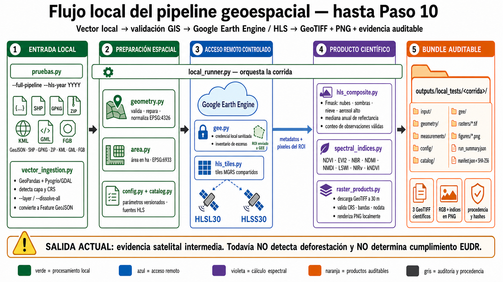

# Pipeline de evidencia geoespacial EUDR

Pipeline reproducible para generar evidencia técnica que apoye la evaluación de
cadenas de carne bovina libres de deforestación en Argentina.

El proyecto genera datos, alertas y productos auditables. No emite
certificaciones legales ni reemplaza la debida diligencia del operador o la
revisión de terceros.

## Estado

El repositorio ya valida, normaliza y repara geometrías vectoriales locales,
mide superficies y puede ejecutar una primera prueba real con HLS en Google
Earth Engine. Para un ROI pequeño construye una mediana anual HLSL30+HLSS30,
aplica Fmask, calcula índices, descarga GeoTIFF y genera PNG locales. Todavía
no implementa lógica de deforestación ni emite una evaluación EUDR. El Paso 11
ya permite materializar un rango de años completos sobre una única grilla fija,
medir cobertura total y por sensor, resumir variables en CSV y generar paneles
temporales locales.

## Requisitos de desarrollo

- Python 3.12
- [uv](https://docs.astral.sh/uv/)
- Git

## Preparación

```powershell
uv sync --dev
```

## Verificaciones

```powershell
uv run ruff check .
uv run ruff format --check .
uv run mypy src tests scripts
uv run pytest
```

Las reglas metodológicas y los límites de alcance se encuentran en
`AGENTS.md`.

## Configuración y contratos

La configuración reproducible inicial se encuentra en `configs/default.yml`.
Puede validarse y convertirse en un hash determinístico mediante las funciones
de `deforestation_pipeline.config`.

Los contratos Pydantic del resumen por establecimiento, la grilla raster y los
metadatos y cobertura de la serie HLS están versionados como JSON Schema. Para
regenerarlos:

```powershell
uv run python scripts/export_schema.py
```

La derivación y las invariantes de la grilla se documentan en
`docs/temporal_grid.md`.

El registro `data/licenses.yml` permanece vacío hasta que un dataset sea
incorporado efectivamente al pipeline. Su presencia en un catálogo no implica
que su licencia haya sido validada para el uso previsto.

## Prueba local con un vector



`pruebas.py` es la puerta local del pipeline. Convierte fuentes legibles por
los drivers GDAL instalados —incluidos GeoJSON, Shapefile, GeoPackage,
FlatGeoBuf, GML, KML y ZIP cuando el driver correspondiente está disponible—
al contrato GeoJSON interno. Para consultar el runtime real:

```powershell
uv run python pruebas.py --list-vector-formats
```

Una capa con varias entidades requiere `--dissolve-all`; una fuente con varias
capas exige `--layer`. Nada se une o selecciona silenciosamente.

```powershell
uv run python pruebas.py data/samples/local_test_polygon.geojson `
  --establishment-id caso-sintetico `
  --analysis-end-date 2026-07-23
```

Cada ejecución crea una carpeta independiente bajo `outputs/local_tests/`.
El paquete incluye todos los archivos de la fuente original, el GeoJSON
convertido, procedencia de la ingesta, geometrías interpretada, normalizada y
de análisis, validación, medición de área, configuración resuelta, plan local
de fuentes HLS, entorno, resumen y un manifiesto con SHA-256 de cada artefacto.
Por defecto no consulta datos remotos y nunca genera todavía una evaluación de
deforestación.

Para ejecutar un único año con la interfaz compatible del Paso 10:

```powershell
uv run python pruebas.py C:/datos/territorio.gpkg `
  --layer parcela `
  --full-pipeline `
  --hls-year 2023 `
  --establishment-id campo-prueba
```

Para ejecutar la serie anual del Paso 11 sobre una única grilla:

```powershell
uv run python pruebas.py C:/datos/territorio.gpkg `
  --layer parcela `
  --full-pipeline `
  --hls-start-year 2019 `
  --hls-end-year 2024 `
  --establishment-id campo-prueba
```

El rango es inclusivo y sólo admite años calendario cerrados. El runner
autentica GEE una vez, descarga cinco GeoTIFF por año —reflectancia, índices y
conteos válidos total/L30/S30—, verifica que todas las grillas sean idénticas y
publica JSON de cobertura, CSV y PNG temporales. No incluye lógica futura de
deforestación.

Para consultar únicamente metadatos reales de HLS en Earth Engine:

```powershell
uv run python pruebas.py data/samples/local_test_polygon.geojson `
  --query-gee `
  --gee-start-date 2021-01-01 `
  --gee-end-date 2021-01-08 `
  --max-scenes-per-source 10
```

Esta opción requiere `credentials.json`, consulta como máximo 366 días y no
descarga píxeles.

Para construir el primer composite anual real y agregar GeoTIFF y PNG:

```powershell
uv run python pruebas.py data/samples/local_test_polygon.geojson `
  --establishment-id hls-2023 `
  --analysis-end-date 2026-07-24 `
  --query-gee `
  --build-hls-composite `
  --gee-start-date 2023-01-01 `
  --gee-end-date 2024-01-01 `
  --max-scenes-per-source 25
```

`--build-hls-composite` exige un año calendario completo. La lista limitada de
`scene_metadata.json` es sólo de inspección: el composite utiliza todas las
escenas coincidentes y conserva su inventario completo por separado.

Documentación relacionada:

- `docs/configuration.md`: parámetros, hash y reglas de reproducibilidad;
- `docs/data_dictionary.md`: contratos de entrada, eventos y salida;
- `docs/geometry_validation.md`: validación GIS local, CRS y reparaciones;
- `docs/area_measurement.md`: estrategias de área, umbral y limitaciones;
- `docs/local_testing.md`: uso, estructura y límites del runner local;
- `docs/source_catalog.md`: HLS v2, bandas, QA y diferencia entre catálogo y uso;
- `docs/hls_annual_series.md`: contrato, QA y artefactos temporales del Paso 11;
- `docs/gee_access.md`: autenticación sanitizada y consultas remotas acotadas.
- `docs/hls_annual_composite.md`: QA, fórmulas, descarga raster y productos PNG.
